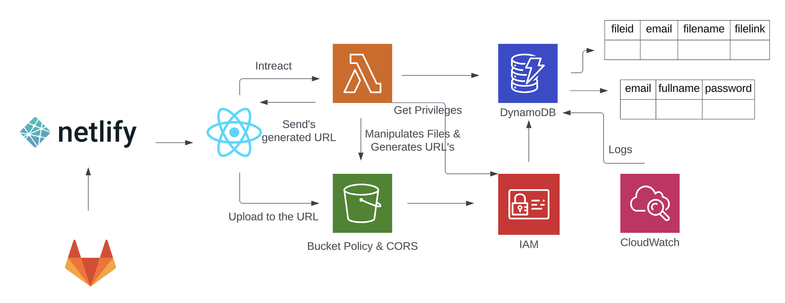
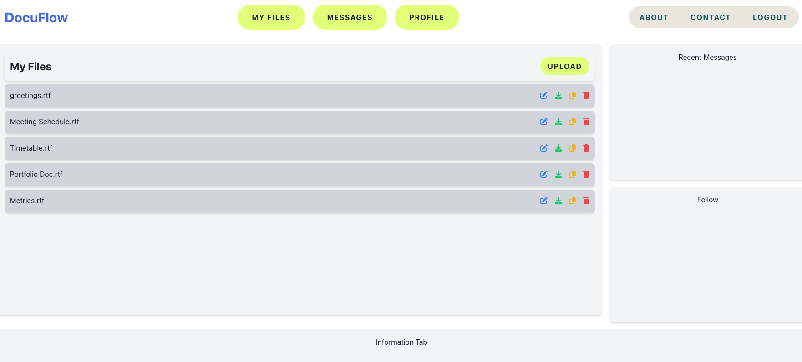

# Document-Managment-AWS

# DocuFlow: Document Management System

**DocuFlow** is a state-of-the-art document management application designed to streamline efficiency and collaboration. Leveraging robust technologies like AWS services and React, DocuFlow provides a responsive and secure environment for managing files with ease.

## Features

### Real-Time Uploads and Notifications
- Utilizes AWS WebSocket for instant file updates and notifications.

### Secure User Authentication
- Implements JWT for secure, token-based user authentication to manage sessions and data access securely.

### Advanced File Search
- Incorporates Elasticsearch, offering powerful search capabilities that allow users to quickly locate files.

### High Scalability
- Scales seamlessly with AWS Lambda's serverless architecture, handling increases in data volume effortlessly.

### Comprehensive User Management
- Detailed user profiles and management features enable effective tracking and management of user activity.

## Technology Stack

- **Frontend**: React for a dynamic and interactive user experience.
- **Backend**: Serverless processing with AWS Lambda for handling backend logic.
- **Storage**: AWS S3 for secure and durable file storage.
- **Database**: Amazon DynamoDB for fast data retrieval and management.

## System Architecture

Below is the architecture diagram illustrating the interaction between different components of DocuFlow:


*Figure 1: System Architecture Diagram*

## User Interface

The user interface is crafted to be intuitive, providing users with easy navigation and accessibility:


*Figure 2: User Interface Flow Diagram*

## Getting Started

To begin using DocuFlow, clone the repository and follow the setup instructions provided in the README file. Ensure your AWS credentials are configured properly to interact with the AWS services used by the application.

```bash
git clone https://github.com/saideep2000/Document-Managment-AWS
cd DocuFlow
npm install
npm start
```

## Frontend

npx create-react-app frontend

cd frontend

npm install aws-amplify @aws-amplify/ui-react

src/aws-exports.js

npm install -D tailwindcss postcss autoprefixer

npx tailwindcss init -p

edit src/index.css to include Tailwind Directives

edit tailwind.config.js

npm install react-router-dom

npm install @fortawesome/fontawesome-svg-core @fortawesome/free-solid-svg-icons @fortawesome/react-fontawesome

npm install aws-amplify @aws-amplify/auth


https://<your domain>/oauth2/authorize?response_type=code&client_id=<your app client id>&redirect_uri=<your callback url>

https://https://docu-flow.auth.us-east-1.amazoncognito.com/oauth2/authorize?response_type=code&client_id=MyAppClient&redirect_uri=https://localhost

https://docu-flow.auth.us-east-1.amazoncognito.com/login?client_id=3m2rmnn8qc1mkoa78gd0ln53ga&response_type=code&scope=email+openid+phone&redirect_uri=https%3A%2F%2Flocalhost

npm install -g @aws-amplify/cli

npm install dotenv

npm install axios

npm install redux react-redux redux-thunk

src/store/index.js basic Redux store

src/store/authReducer.js Create a file for the auth reducer which will handle actions related to auth

src/store/authActions.js actions for handling login, signup, and logout functionalities

src/index.js to include the Redux provider


npm install redux-persist


## Backend

